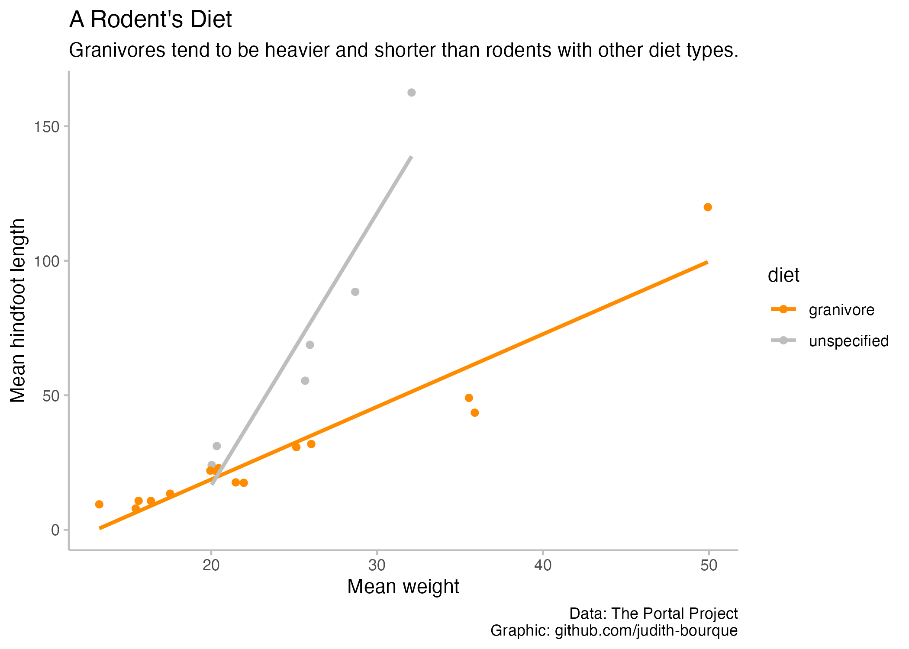

<!-- README.md is generated from README.Rmd. Please edit that file -->

```{r, include = FALSE}
knitr::opts_chunk$set(
  collapse = TRUE,
  comment = "#>"
)
```

# tidytuesday

<!-- badges: start -->
<!-- badges: end -->

The goal of tidytuesday is to share the code behind my graphs for tidytuesday.

## 2023-05-02



## 2023-04-25


## 2023-04-18


